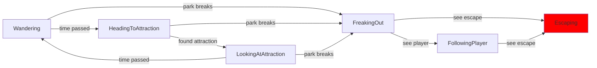

```mermaid
graph LR;
    Wandering -- time passed --> HeadingToAttraction
    HeadingToAttraction -- found attraction --> LookingAtAttraction
    LookingAtAttraction -- time passed --> Wandering

    Wandering -- park breaks --> FreakingOut
    HeadingToAttraction -- park breaks --> FreakingOut
    LookingAtAttraction -- park breaks --> FreakingOut
    
    FreakingOut -- see player --> FollowingPlayer
    
    FreakingOut -- see escape --> Escaping
    FollowingPlayer -- see escape --> Escaping
    style Escaping fill:#f00

```
