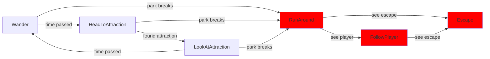

```mermaid
graph LR;
    Wander -- time passed --> HeadToAttraction
    HeadToAttraction -- found attraction --> LookAtAttraction
    LookAtAttraction -- time passed --> Wander

    Wander -- park breaks --> RunAround
    HeadToAttraction -- park breaks --> RunAround
    LookAtAttraction -- park breaks --> RunAround
    
    RunAround -- see player --> FollowPlayer
    style RunAround fill:#f00
    
    RunAround -- see escape --> Escape
    FollowPlayer -- see escape --> Escape
    style FollowPlayer fill:#f00
    style Escape fill:#f00

```
